# DecodeLabs-Internship

# INTERNSHIP PROJECTS PORTFOLIO

## Overview

This repository contains data analysis projects completed during my Data Analytics Internship at DecodeLabs. The projects span the full analytics workflow — from data cleaning and preparation through exploratory data analysis, SQL querying, and interactive Power BI dashboard development — using a real-world e-commerce transaction dataset (1,200 orders, January 2023–June 2025, 1,189 unique customers) to generate meaningful business insights.

---

## Project 1: Data Cleaning and Preparation

### Project Description
The goal of this project was to clean and prepare a raw e-commerce transaction dataset for analysis using Microsoft Excel and Power Query. The dataset contained data quality issues — including blank cells and inconsistent currency formatting — which were identified and resolved to produce a clean, structured dataset ready for reporting.

### Objectives
- Improve overall data quality
- Handle missing and blank values
- Correct data types and currency formatting across all columns
- Prepare the dataset for downstream analysis (EDA, SQL, Power BI)

### Tools Used
- Microsoft Excel
- Power Query

### Dataset Information
1,200 orders across 1,189 unique customers, spanning January 2023–June 2025.

| Column | Data Type |
|---|---|
| OrderID | Text |
| Date | Date |
| CustomerID | Text |
| Product | Text |
| Quantity | Whole Number |
| UnitPrice | Currency |
| ShippingAddress | Text |
| PaymentMethod | Text |
| OrderStatus | Text |
| TrackingNumber | Text |
| ItemsInCart | Whole Number |
| CouponCode | Text |
| ReferralSource | Text |
| TotalPrice | Currency |

The dataset contains 1,200 rows and 14 columns. The `CouponCode` column had 309 blank/null cells; all other columns had no missing values. No duplicate `OrderID` records were found.

### Data Cleaning Process
- Converted the raw range into an Excel Table
- Loaded the table into Power Query for transformation
- Corrected data types across columns
- Standardized currency to USD ($) throughout
- Replaced blank/null `CouponCode` values with "No Coupon Code"
- Checked for duplicate `OrderID` records — none were found
- Loaded the cleaned table back into Excel

**Messy_Dataset** — the raw, unprocessed dataset as originally received.

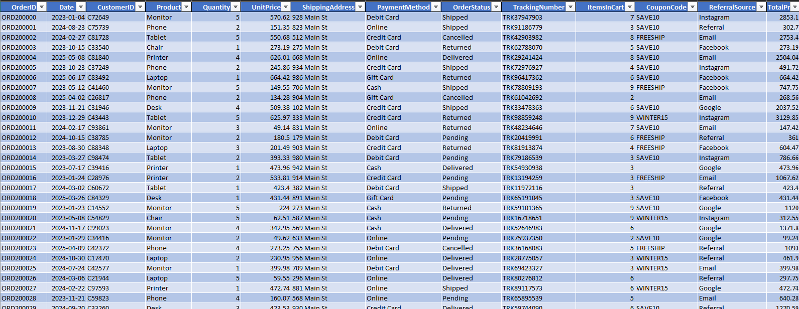

**Power_Query_Transformation** — the applied Power Query steps used to clean, standardize, and reshape the data.

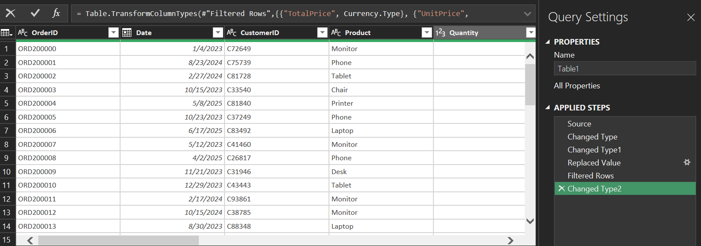

**Cleaned_Dataset** — the final, analysis-ready dataset used across the rest of the project.

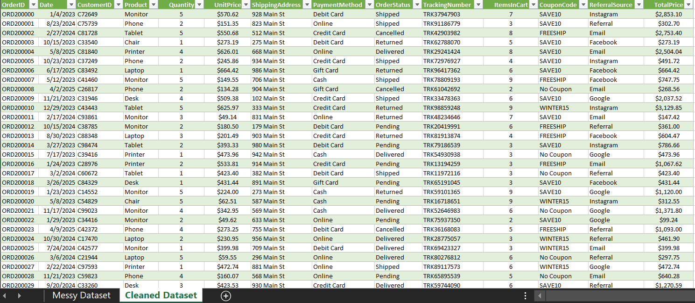

### Challenges Faced
- Identifying and correcting inconsistent currency formatting across the dataset
- Deciding how to handle blank/null coupon code values without losing data integrity
- Verifying correct data types were applied across all columns after import

### Outcome
The raw dataset was transformed into a clean, organized, analysis-ready table with correct data types and standardized formatting — suitable for reporting and further analysis.

---

## Project 2: Exploratory Data Analysis (EDA)

### Project Description
This project involved performing Exploratory Data Analysis on the cleaned e-commerce dataset using Microsoft Excel (Power Pivot and DAX) to uncover trends, patterns, and business insights from the transaction data.

### Objectives
- Analyze trends and patterns in the dataset
- Summarize data using descriptive statistics
- Identify key performance observations and outliers
- Generate actionable, stat-grounded business insights

### Tools Used
- Microsoft Excel
- Descriptive Statistics
- Pivot Tables
- IQR Outlier Detection

### Analytical Techniques Used
- Mean, Median, Quartiles
- IQR (Interquartile Range) for Outlier Detection
- Pivot Table Summarization

**Descriptive_Statistics** — summary statistics across key numeric fields, primarily order value.
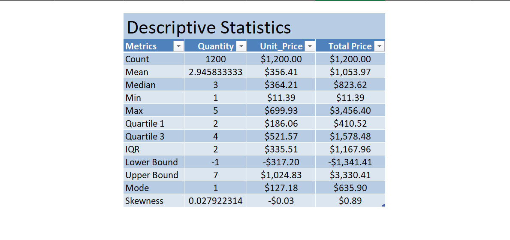

**Pivot_Tables** — eight pivot tables summarizing revenue and orders across product, referral source, payment method, and time period.

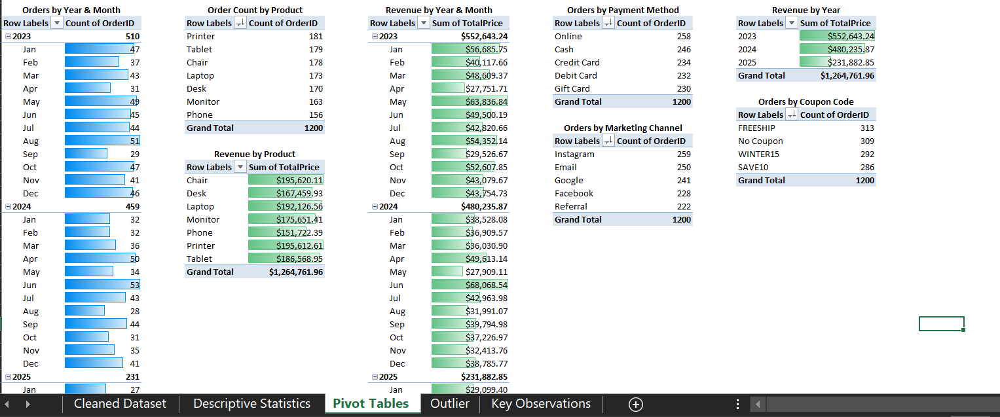

### Outlier Analysis (IQR Method)

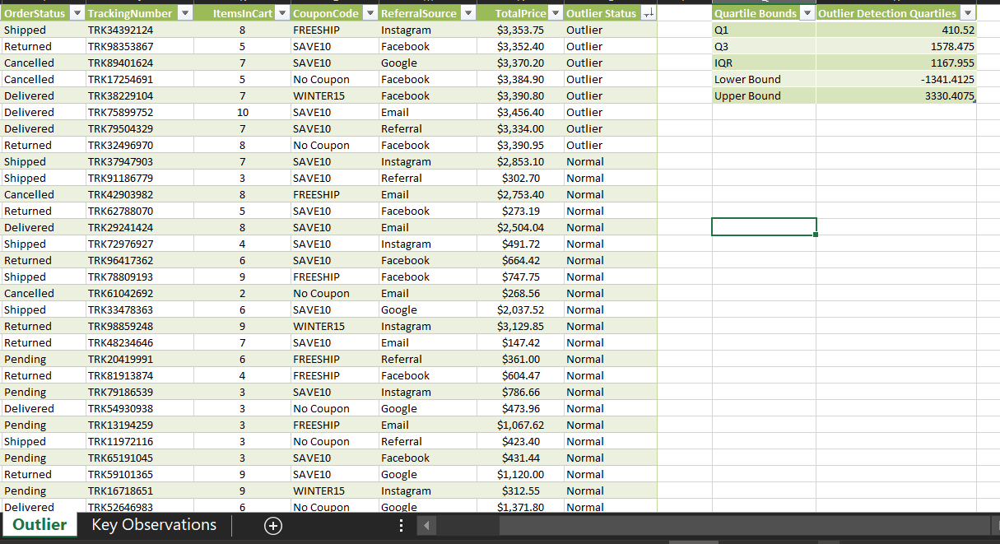

| Metric | Value |
|---|---|
| Q1 | $410.52 |
| Q3 | $1,578.48 |
| IQR | $1,167.96 |
| Upper Bound | $3,330.41 |
| Outliers Identified | 8 |
| Outlier Value Range | $3,334 – $3,456 |

### Key Observations

| Metric | Value |
|---|---|
| Coupon Usage Rate | ~74% of orders |
| Revenue per Customer | ~$1,064 |
| Orders per Customer | ~1.01 |

The near-1.0 orders-per-customer figure indicates a largely one-time-purchase customer base rather than repeat buyers.

### Challenges Faced
- Determining the right outlier threshold (IQR-based rather than an arbitrary cutoff) to avoid excluding legitimate high-value orders
- Organizing eight separate pivot tables without the workbook becoming cluttered

### Outcome
The EDA surfaced meaningful insights into order value distribution, customer purchasing behavior, and coupon usage through statistical summaries and pivot-based analysis.

---

## Project 3: SQL Retail Data Analysis

### Project Overview
This project involved analyzing the e-commerce orders dataset using Microsoft SQL Server and SQL Server Management Studio (SSMS). The objective was to apply SQL querying, data cleaning, aggregation, and reporting techniques to extract meaningful business insights from retail transaction data.

### Tools Used
- Microsoft SQL Server
- SQL Server Management Studio (SSMS)
- SQL

### Database Setup and Data Cleaning
The dataset was loaded into a SQL Server database (`EcommerceAnalytics`), into an `Orders` table. Data cleaning and validation were performed directly in SQL:

- Checked total row count and scanned `OrderID` for duplicates (none found)
- Checked for NULLs across `CustomerID`, `Date`, `Quantity`, `UnitPrice`, `ShippingAddress`, `PaymentMethod`, `CouponCode`
- Replaced blank/NULL `CouponCode` values with `'No Coupon'`
- Corrected numeric precision: `UnitPrice` → DECIMAL(10,2), `TotalPrice` → DECIMAL(12,2)
- Verified `TotalPrice = Quantity × UnitPrice`, flagging any mismatches

### Query Images
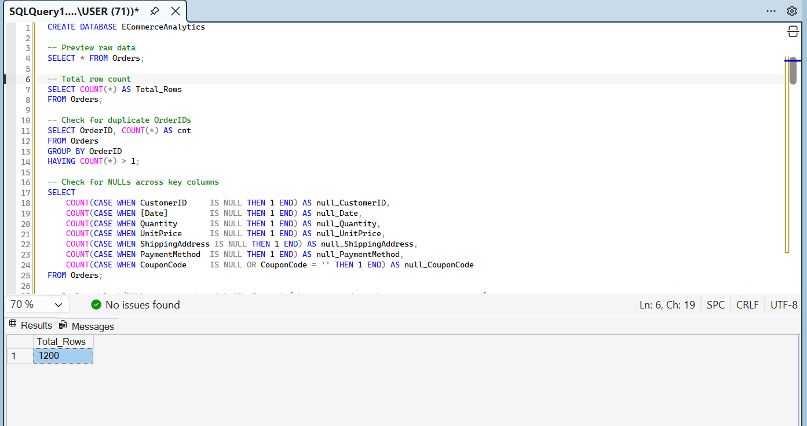

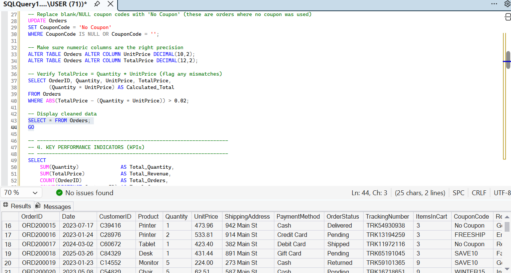

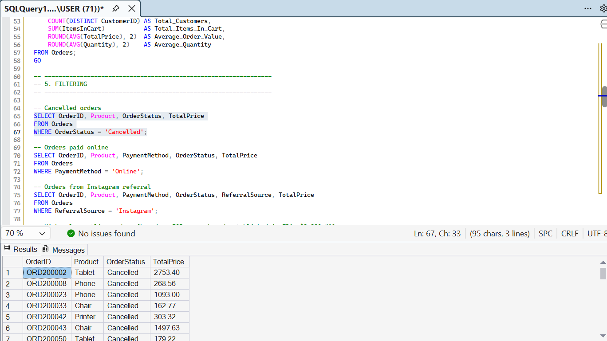

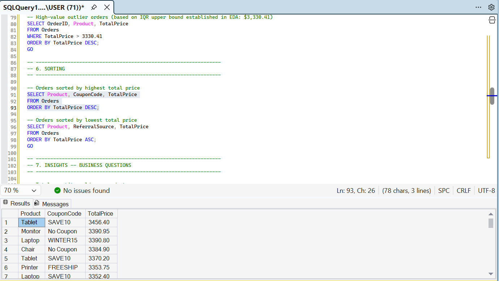

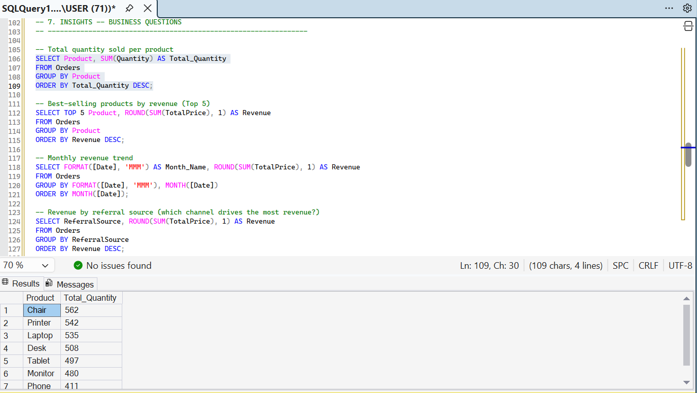

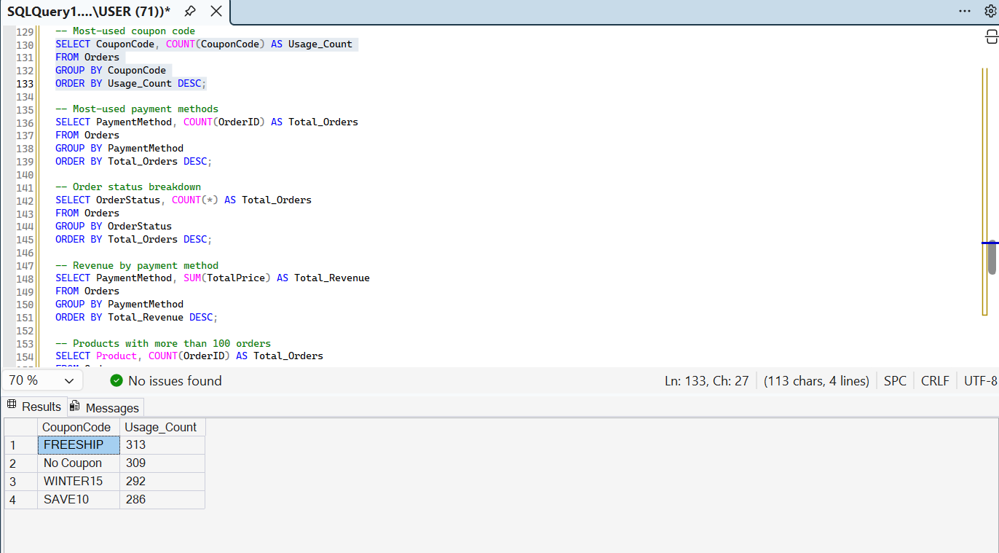

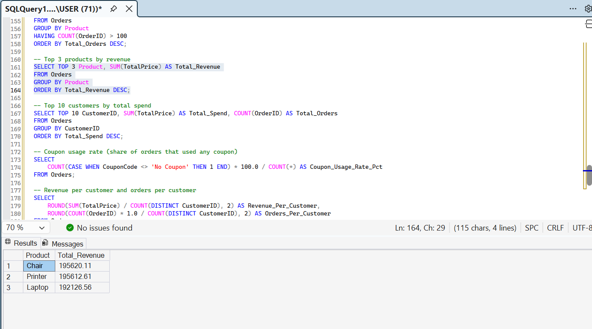

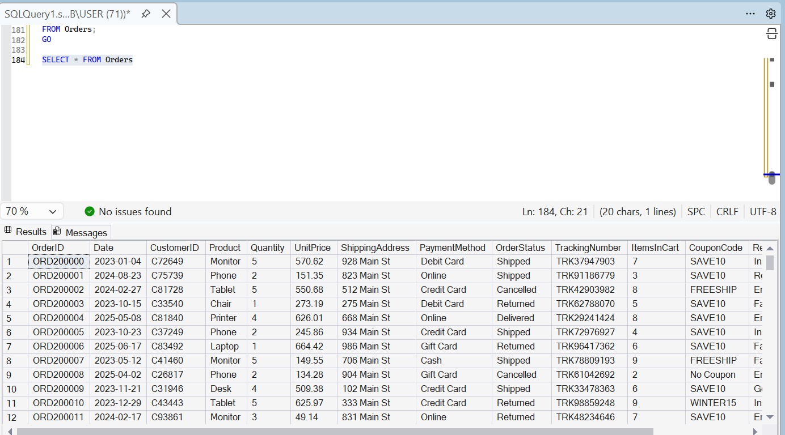

### SQL Skills and Techniques Applied

**SQL Clauses and Operations**
- `SELECT`, `WHERE`, `ORDER BY`
- `GROUP BY`, `HAVING`, `TOP`
- `UPDATE`, `ALTER TABLE`

**Aggregate Functions**
- `SUM()`, `AVG()`, `COUNT()`, `ROUND()`

**Additional SQL Techniques**
- Date extraction/formatting: `FORMAT()`, `MONTH()
- CASE expressions for conditional counts
- Conditional filtering (e.g. outlier threshold from EDA: $3,330.41)
- Data aggregation and grouping
- Business reporting queries

### Key Findings and Business Insights

**Overall Metrics Performance**

| Metric | Value |
|---|---|
| Total Orders | 1,200 |
| Total Revenue | $1,264,761.96 |
| Average Order Value | $1,053.97 |
| Average Quantity Ordered | 3 items |
| Cancelled Orders | 250 |

**Customer and Payment Insights**

| Insight | Detail |
|---|---|
| Most Used Payment Method | Online (258 transactions) |
| Highest Revenue Payment Method | Credit Card — $263,847.63 |
| Top Referral Source | Instagram (259 referrals) |
| Highest Revenue Referral Source | Instagram — $275,285.45 |

**Product Performance**

Top 3 Products by Revenue

| Product | Revenue |
|---|---|
| Chair | $195,620.11 |
| Printer | $195,612.61 |
| Laptop | $192,126.56 |

Highest individual order: Tablet, $3,456.40 (SAVE10 coupon). Lowest individual order: Phone, $11.39.

**Revenue by Payment Method**

| Payment Method | Total Revenue |
|---|---|
| Credit Card | $263,847.63 |
| Online | $262,442.94 |
| Cash | $259,786.29 |
| Gift Card | $246,323.92 |
| Debit Card | $232,361.18 |

**Revenue by Referral Source**

| Referral Source | Total Revenue |
|---|---|
| Instagram | $275,285.45 |
| Email | $261,808.55 |
| Google | $250,441.48 |
| Facebook | $250,410.90 |
| Referral | $226,815.58 |

**Customer Behavior**

| Metric | Value |
|---|---|
| Coupon Usage Rate | 74.25% of orders |
| Revenue per Customer | $1,063.72 |
| Orders per Customer | 1.01 |

**Monthly Revenue Trend**

| Month | Revenue |
|---|---|
| Jan | $124,313.2 |
| Feb | $112,344.8 |
| Mar | $123,840.9 |
| Apr | $109,186.0 |
| May | $135,142.6 |
| Jun | $170,616.1 |
| Jul | $85,784.6 |
| Aug | $86,343.2 |
| Sep | $69,321.6 |
| Oct | $89,834.8 |
| Nov | $75,493.4 |
| Dec | $82,540.5 |

June is the highest-revenue month; September is the lowest.

### Conclusion
This project demonstrated practical SQL and data analysis skills through a real-world retail dataset. SQL queries were used to clean, organize, analyze, and summarize transactional data into actionable business insights covering customer behavior, product performance, payment trends, and revenue distribution.

---

## Project 4: Data Visualization

### Project Description
This project translated the cleaned data and prior analysis into an interactive, three-page Power BI dashboard suite (plus a supporting tooltip page), designed to communicate business performance clearly to a non-technical audience.

### Tools Used
- Power BI
- DAX Measures

### Dashboards

**Executive Overview**

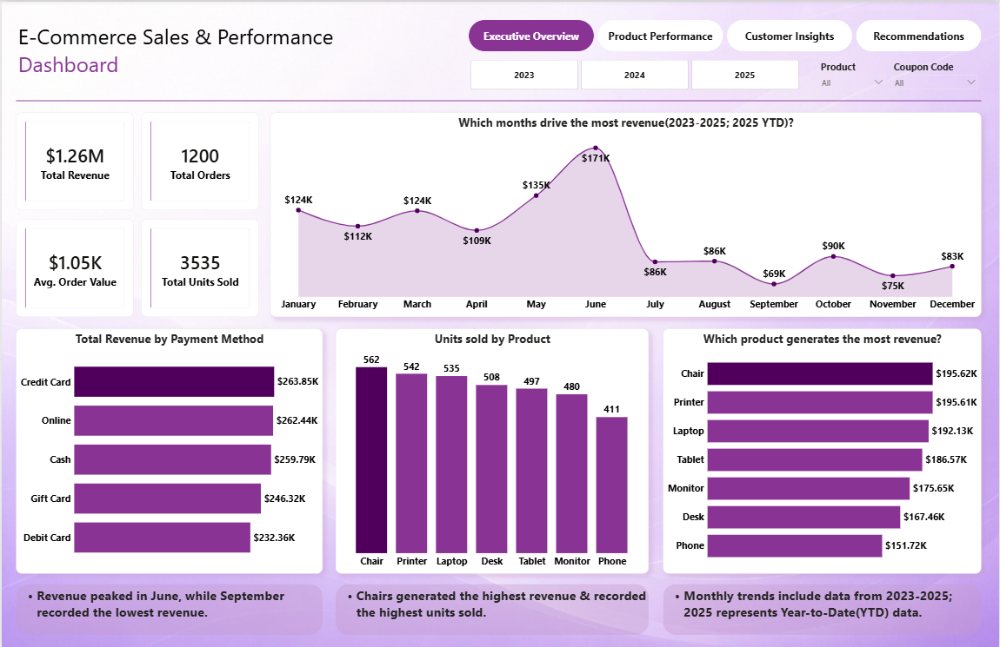

| KPI | Value |
|---|---|
| Highest Revenue Month | June (~$170,616) |
| Lowest Revenue Month | September (~$69,322) |
| Total Revenue | $1,264,761.96 |
| Total Units Sold | 3,535 |
| Average Order Value | $1,053.97 |

**Product_Performance** — revenue and order volume broken down by product category: Monitor, Phone, Tablet, Chair, Printer, Laptop, and Desk.

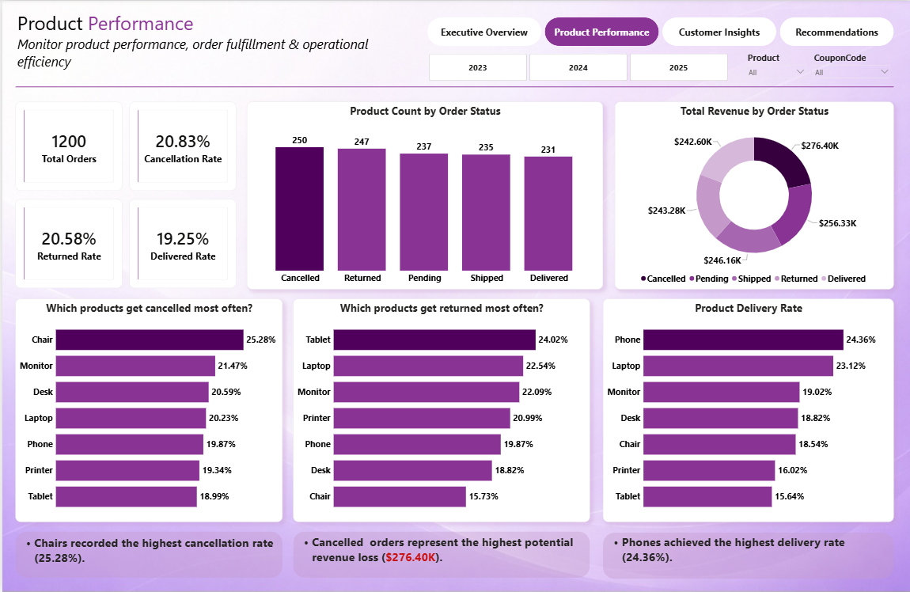

**Customer_Insights** — customer-level metrics including top customers and referral source breakdown across Instagram, Google, Email, Facebook, and Referral channels.

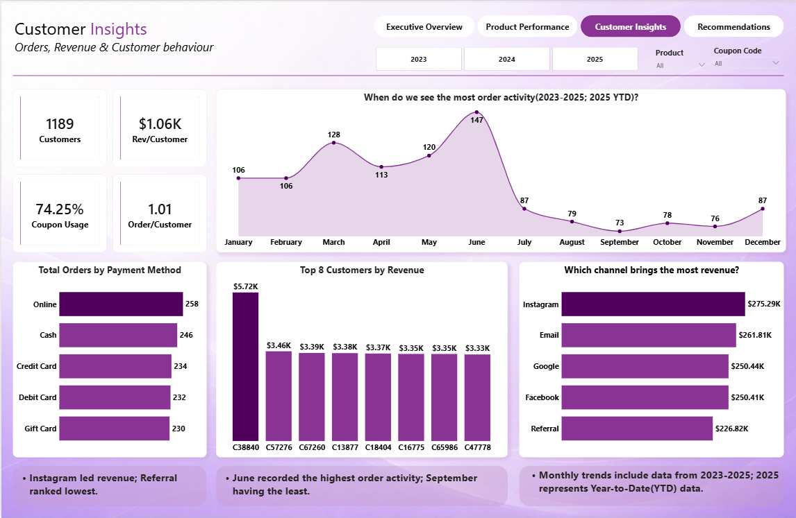

**Recommendations** — data-driven recommendations derived from the dashboard findings, delivered as a supporting written report.

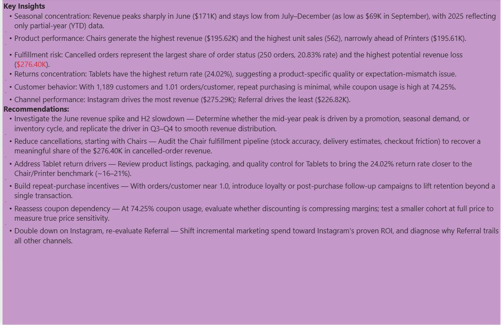

### Outcome
The dashboard suite provides a decision-ready view of revenue trends, product performance, and customer behavior, supporting data-informed business recommendations.

---

## Overall Tools Summary
- Microsoft Excel (Power Query)
- SQL Server & SSMS
- Power BI(DAX)

---

